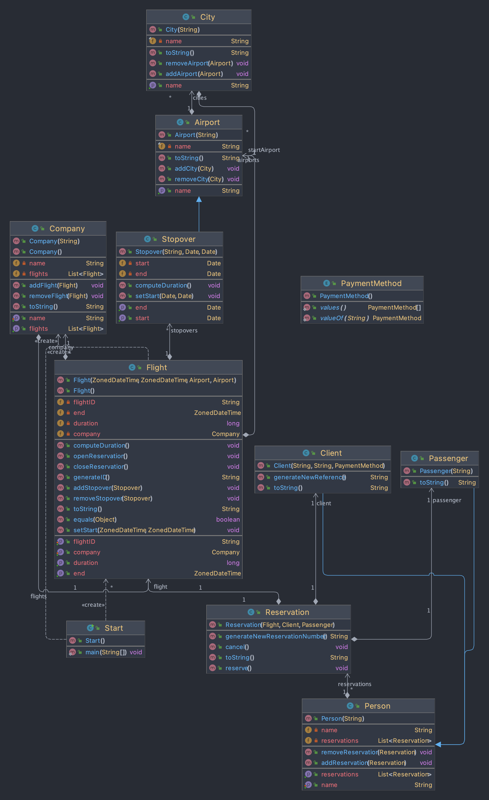

# Projet de Génie Logiciel 

Implémentation d'un système de transport aérien en Java. Utilisation de Gradle comme outil de build. Réalisation de tests unitaires. 

## Comment lancer ? 🚀
A l'aide de gradle : 
``
gradle run 
``

## Comment tester ? ✅
``
gradle :test --tests "Tests"
``

## Comment le projet est il implémenté ? 

## Auteurs 

| Nom                |                           Github                           | 
|--------------------|:----------------------------------------------------------:|
| Hardy Dorian       |     [@thegostisdead](https://github.com/thegostisdead)     |
| Théo Peuchlestrade | [@theopeuchlestrade](https://github.com/theopeuchlestrade) |

